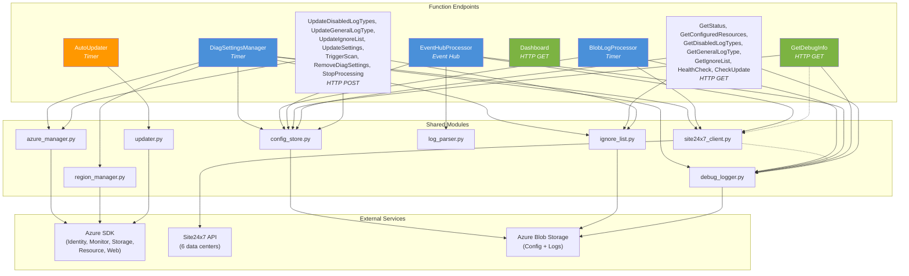

# Azure Diagnostic Logs Collection — Developer Guide

> Complete reference for developing, testing, debugging, and extending the Site24x7 Azure Diagnostic Logs function app.

---

## Table of Contents

1. [Getting Started](#1-getting-started)
2. [Architecture Overview](#2-architecture-overview)
3. [Module API Reference](#3-module-api-reference)
4. [Function Call Chains](#4-function-call-chains)
5. [How to Add a New Azure Log Type](#5-how-to-add-a-new-azure-log-type)
6. [How to Add a New Function Endpoint](#6-how-to-add-a-new-function-endpoint)
7. [Testing Guide](#7-testing-guide)
8. [Error Handling & Resilience](#8-error-handling--resilience)
9. [Debugging & Troubleshooting](#9-debugging--troubleshooting)
10. [Deployment](#10-deployment)
11. [Contributing Guidelines](#11-contributing-guidelines)
12. [Processing Capacity & Limits](#12-processing-capacity--limits)

---

## 1. Getting Started

### Prerequisites

| Tool | Version | Notes |
|------|---------|-------|
| Python | **3.9+** | ⚠️ `python` on macOS is Python 2.7 — always use **`python3`** |
| Azure Functions Core Tools | v4 | `brew install azure-functions-core-tools@4` |
| Azure CLI | latest | `brew install azure-cli` |
| Git | any | |

### Clone and Install

```bash
git clone <repo-url>
cd diagnostic-logs-collection/function-app

# Create a virtual environment (always use python3)
python3 -m venv .venv
source .venv/bin/activate

# Install runtime + dev dependencies
pip install -r requirements.txt
pip install -r requirements-dev.txt
```

**Critical dependency constraints:**

| Package | Constraint | Reason |
|---------|-----------|--------|
| `azure-mgmt-monitor` | `>=8.0.0b1` | v7 removed the `diagnostic_settings` APIs entirely |
| `azure-storage-blob` | `>=12.20.0,<12.28.0` | v12.28.0 introduced a broken async import that crashes the function app |

Full `requirements.txt`:

```
azure-functions
azure-identity
azure-mgmt-resource
azure-mgmt-monitor>=8.0.0b1
azure-mgmt-storage
azure-mgmt-web
azure-storage-blob>=12.20.0,<12.28.0
requests
```

### Configure local.settings.json

Create `function-app/local.settings.json` (this file is gitignored):

```json
{
  "IsEncrypted": false,
  "Values": {
    "AzureWebJobsStorage": "DefaultEndpointsProtocol=https;AccountName=<your-sa>;AccountKey=<your-key>;EndpointSuffix=core.windows.net",
    "FUNCTIONS_WORKER_RUNTIME": "python",
    "SUBSCRIPTION_IDS": "xxxxxxxx-xxxx-xxxx-xxxx-xxxxxxxxxxxx",
    "SITE24X7_API_KEY": "your-device-key",
    "SITE24X7_BASE_URL": "https://www.site24x7.com",
    "RESOURCE_GROUP_NAME": "s247-diag-logs-rg",
    "DIAG_STORAGE_SUFFIX": "diag123",
    "GENERAL_LOGTYPE_ENABLED": "false",
    "PROCESSING_ENABLED": "true",
    "TIMER_SCHEDULE": "0 */30 * * * *"
  }
}
```

For **local development against the mock server**, override:

```json
{
  "Values": {
    "SITE24X7_BASE_URL": "http://localhost:8999",
    "SITE24X7_UPLOAD_DOMAIN": "http://localhost:8999",
    "SITE24X7_API_KEY": "mock-device-key"
  }
}
```

### Run Tests

```bash
cd function-app
python3 -m pytest tests/ -v
```

This runs all 217 unit tests. See [Testing Guide](#7-testing-guide) for details.

### Run Locally with Mock Server

**Terminal 1 — Start the mock Site24x7 server:**

```bash
python3 testing/mock_s247_server.py
# Listening on http://localhost:8999
```

**Terminal 2 — Start the function app:**

```bash
cd function-app
func start
```

The function app will discover functions and expose HTTP endpoints at `http://localhost:7071/api/...`.

---

## 2. Architecture Overview

### Programming Model

This function app uses the **Azure Functions Python V1 programming model**. Each function is a **direct child folder** of the project root containing:

```
function-app/
├── FunctionName/
│   ├── function.json      # Trigger binding definition
│   └── __init__.py        # Entry point with main() function
├── shared/                # Shared modules (imported by functions)
├── host.json
├── requirements.txt
└── VERSION
```

> **Important:** Functions must be direct child folders of the project root. Nested folders (e.g., `functions/MyFunc/`) are **not** supported by the V1 model.

### Functions at a Glance

| Function | Trigger | Purpose |
|----------|---------|---------|
| **DiagSettingsManager** | Timer (`%TIMER_SCHEDULE%`) | Scan Azure resources, create/reconcile diagnostic settings |
| **BlobLogProcessor** | Timer (every 2 min) | Process diagnostic log blobs, upload to Site24x7 |
| **EventHubProcessor** | Event Hub | Process logs streamed via Event Hub |
| **GetDebugInfo** | HTTP GET `/api/debug` | Return diagnostic/debug bundle |
| **GetStatus** | HTTP GET | Return function app status |
| **GetConfiguredResources** | HTTP GET | Return list of configured resources |
| **GetDisabledLogTypes** | HTTP GET | Return disabled log types |
| **GetGeneralLogType** | HTTP GET | Return general log type config |
| **GetIgnoreList** | HTTP GET | Return ignore list rules |
| **UpdateDisabledLogTypes** | HTTP POST | Update disabled log types |
| **UpdateGeneralLogType** | HTTP POST | Update general log type config |
| **UpdateIgnoreList** | HTTP POST | Update ignore list rules |
| **UpdateSettings** | HTTP POST | Update function app settings |
| **TriggerScan** | HTTP POST | Manually trigger a DiagSettings scan |
| **RemoveDiagSettings** | HTTP POST | Remove all diagnostic settings |
| **StopProcessing** | HTTP POST | Disable log processing |
| **HealthCheck** | HTTP GET | Health probe endpoint |
| **CheckUpdate** | HTTP GET | Check for available updates |
| **AutoUpdater** | Timer | Periodically check and apply updates |
| **Dashboard** | HTTP GET | Serve the management dashboard UI |

### Module Dependency Graph



> Dashed arrows (`-.->`) indicate optional/lazy imports.

### Data Flow Summary

```
┌──────────────────────────────────────────────────────────────────────────┐
│ 1. DISCOVERY (DiagSettingsManager — runs on timer)                      │
│                                                                         │
│  Azure Resources ──scan──▶ Filter (ignore list) ──▶ Get categories     │
│  Site24x7 API ◀──create log types──▶ Config Store (blob)               │
│  Azure Monitor ◀──create diagnostic settings──▶ Regional Storage Accts │
└──────────────────────────────────────────────────────────────────────────┘
                                    │
                    diagnostic logs flow to storage
                                    ▼
┌──────────────────────────────────────────────────────────────────────────┐
│ 2. PROCESSING (BlobLogProcessor — runs every 2 min)                     │
│                                                                         │
│  Regional Storage ──read blobs──▶ Parse JSON records                   │
│  Config Store ──get sourceConfig──▶ Transform + filter                 │
│  Site24x7 Upload ◀──POST gzipped logs──▶ Delete processed blobs       │
│  Checkpoints ──track progress──▶ Resume on next run                    │
└──────────────────────────────────────────────────────────────────────────┘
                                    │
                           logs visible in Site24x7
                                    ▼
┌──────────────────────────────────────────────────────────────────────────┐
│ 3. MANAGEMENT (Dashboard + HTTP endpoints)                              │
│                                                                         │
│  Dashboard UI ──▶ GET/POST endpoints ──▶ Config Store / Azure Manager  │
│  Debug endpoint ──▶ Events, stats, config validation, S247 test        │
└──────────────────────────────────────────────────────────────────────────┘
```

---

## 3. Module API Reference

All shared modules live in `function-app/shared/`. Each module is self-contained — the only cross-module dependency is `site24x7_client.py` lazily importing `debug_logger.log_event` in exception handlers.

### shared/azure_manager.py

Manages Azure resource discovery, diagnostic categories, and diagnostic settings via Azure SDK.

**Imports:** `azure.identity.DefaultAzureCredential`, `azure.mgmt.resource.ResourceManagementClient`, `azure.mgmt.monitor.MonitorManagementClient`

#### Class: `AzureManager`

| Method | Signature | Returns | Description |
|--------|-----------|---------|-------------|
| `__init__` | `()` | `None` | Initialize with `DefaultAzureCredential` and diagnostic support cache |
| `supports_diagnostic_logs` | `(resource_id: str, resource_type: str)` | `bool` | Check if resource type supports diagnostic logs (cached) |
| `get_all_resources` | `(subscription_ids: List[str])` | `List[Dict]` | List resources supporting diagnostic logs across subscriptions |
| `get_diagnostic_categories` | `(resource_id: str)` | `List[str]` | Get supported log categories for a resource |
| `get_diagnostic_setting` | `(resource_id: str, setting_name: str = "s247-diag-logs")` | `Optional[Dict]` | Check/retrieve diagnostic setting details |
| `create_diagnostic_setting` | `(resource_id: str, storage_account_id: str, categories: Optional[List[str]] = None, setting_name: str = "s247-diag-logs")` | `bool` | Create or update diagnostic setting |
| `delete_diagnostic_setting` | `(resource_id: str, setting_name: str = "s247-diag-logs")` | `bool` | Delete diagnostic setting |
| `list_resource_groups` | `(subscription_id: str)` | `List[str]` | List all resource groups in subscription |
| `list_locations` | `(subscription_id: str)` | `List[str]` | List all locations with resources |
| `update_app_setting` | `(key: str, value: str)` | `bool` | Update Function App setting via `WebSiteManagementClient` |
| `remove_all_diagnostic_settings` | `(subscription_ids: List[str])` | `Dict[str, Any]` | Bulk removal with summary |

#### Module-level Functions

| Function | Signature | Returns |
|----------|-----------|---------|
| `_extract_subscription_id` | `(resource_id: str)` | `str` |
| `_extract_resource_group` | `(resource_id: str)` | `str` |

---

### shared/config_store.py

Blob-backed configuration store with in-memory caching. Stores supported log types, disabled types, logtype configs, configured resources, and scan state.

**Imports:** `azure.storage.blob.BlobServiceClient`

**In-Memory Cache:** Supported types, disabled types, logtype configs, configured resources. Cache is cleared at the start of each function invocation via `clear_cache()`.

#### Public Functions

| Function | Signature | Returns | Description |
|----------|-----------|---------|-------------|
| `get_supported_log_types` | `()` | `Dict` | Get supported log types (cached from blob) |
| `save_supported_log_types` | `(types_data: Dict)` | `bool` | Save types and update cache |
| `is_supported_log_type` | `(category: str)` | `bool` | Check if category matches a supported type |
| `get_logtype_config` | `(category: str)` | `Optional[Dict]` | Get sourceConfig for a category |
| `save_logtype_config` | `(category: str, config: Dict)` | `bool` | Save sourceConfig |
| `delete_logtype_config` | `(category: str)` | `bool` | Delete sourceConfig |
| `get_all_logtype_configs` | `()` | `Dict[str, Dict]` | List all stored logtype configs |
| `get_disabled_log_types` | `()` | `List[str]` | Get disabled categories |
| `save_disabled_log_types` | `(disabled: List[str])` | `bool` | Save disabled list |
| `disable_log_type` | `(category: str)` | `bool` | Add to disabled list |
| `enable_log_type` | `(category: str)` | `bool` | Remove from disabled list |
| `is_log_type_disabled` | `(category: str)` | `bool` | Check if disabled |
| `get_configured_resources` | `()` | `Dict` | Get map of configured resources |
| `save_configured_resources` | `(resources: Dict)` | `bool` | Save configured map |
| `mark_resource_configured` | `(resource_id: str, categories: List[str], storage_account: str)` | `bool` | Mark resource as configured with metadata |
| `unmark_resource_configured` | `(resource_id: str)` | `bool` | Remove from configured tracking |
| `clear_cache` | `()` | `None` | Clear all in-memory caches |
| `save_scan_state` | `(state: Dict)` | `bool` | Save scan state to blob |
| `get_scan_state` | `()` | `Dict` | Load scan state from blob |

#### Internal Functions

| Function | Signature | Returns |
|----------|-----------|---------|
| `_get_service_client` | `()` | `Optional[BlobServiceClient]` |
| `_ensure_container` | `(service_client: BlobServiceClient)` | `None` |
| `_read_blob` | `(blob_path: str)` | `Optional[str]` |
| `_write_blob` | `(blob_path: str, data: str)` | `bool` |
| `_delete_blob` | `(blob_path: str)` | `bool` |

---

### shared/site24x7_client.py

Site24x7 API client with circuit breaker and rate limiter resilience patterns. Handles log parsing, transformation, masking, hashing, and upload.

**Imports:** `requests`, custom regex/hashing/filtering logic

#### Class: `CircuitBreaker`

```python
CircuitBreaker(failure_threshold: int = 5, recovery_timeout: int = 900)
# Persistent (blob-backed) — state survives across function invocations
# Blob: s247-config/config/circuit-breaker-state.json
```

| Method | Signature | Returns | Description |
|--------|-----------|---------|-------------|
| `record_success` | `()` | `None` | Reset failure count, close circuit |
| `record_failure` | `()` | `None` | Increment counter, open if threshold exceeded |
| `can_execute` | `()` | `bool` | Check if operation allowed (handles half-open state) |

**States:** `closed` (normal) → `open` (after 5 failures) → `half_open` (after 300s recovery timeout)

#### Class: `RateLimiter`

```python
RateLimiter(rate: int = 100, per: float = 1.0)
```

| Method | Signature | Returns | Description |
|--------|-----------|---------|-------------|
| `acquire` | `()` | `None` | Acquire token, sleep if necessary |

Token bucket pattern: tokens refill at `rate / per` per second. Default is 100 requests/second.

#### Class: `Site24x7Client`

| Method | Signature | Returns | Description |
|--------|-----------|---------|-------------|
| `__init__` | `()` | `None` | Initialize with API key, base URL, circuit breaker, rate limiter |
| `get_supported_log_types` | `()` | `Optional[Dict]` | Fetch supported types from `/applog/azure/logtype_supported` |
| `create_log_type` | `(category: str)` | `Optional[Dict]` | Create/check single log type, returns sourceConfig dict |
| `create_log_types` | `(categories: List[str])` | `Optional[List[Dict]]` | Batch create, returns list of `{category, sourceConfig}` |
| `post_logs` | `(source_config_b64: str, log_events: List[Dict])` | `bool` | Parse and POST logs using circuit breaker + rate limiter |
| `get_general_log_type_config` | `()` | `Optional[str]` | Get base64 general catch-all config from env |

#### Log Parsing/Transformation Functions

| Function | Signature | Returns | Description |
|----------|-----------|---------|-------------|
| `_get_timestamp` | `(datetime_string: str, format_string: str)` | `int` | Parse datetime to milliseconds since epoch |
| `_get_json_value` | `(obj: Dict, key: str, datatype: Optional[str] = None)` | `Any` | Extract nested JSON values (dot notation) |
| `_is_filters_matched` | `(formatted_line: Dict, config: Dict)` | `bool` | Check if line matches filter config |
| `_apply_masking` | `(formatted_line: Dict, masking_config: Dict)` | `int` | Apply regex-based masking, return size adjustment |
| `_apply_hashing` | `(formatted_line: Dict, hashing_config: Dict)` | `int` | Apply SHA256 hashing to matched groups |
| `_apply_derived_fields` | `(formatted_line: Dict, derived_fields: Dict)` | `int` | Extract derived fields using regex |
| `_json_log_parser` | `(log_events: List[Dict], config: Dict, masking_config, hashing_config, derived_fields)` | `Tuple[List[Dict], int]` | Full log parsing pipeline: `(parsed_lines, total_size)` |
| `_send_logs_to_s247` | `(config: Dict, gzipped_data: bytes, log_size: int)` | `None` | POST gzipped logs to Site24x7 upload endpoint |

#### Internal Methods

| Method | Signature | Returns |
|--------|-----------|---------|
| `_make_s247_request` | `(path: str, params: Optional[Dict] = None, method: str = "GET")` | `Optional[Dict]` |
| `_get_upload_domain` | `()` | `str` |
| `_proxy_api_request` | `(path: str, params: Dict, method: str)` | `Optional[Dict]` |

---

### shared/region_manager.py

Manages per-region storage account lifecycle (provisioning, deprovisioning, reconciliation).

**Imports:** `azure.identity.DefaultAzureCredential`, `azure.mgmt.storage.StorageManagementClient`, `azure.mgmt.resource.ResourceManagementClient`

#### Class: `RegionManager`

```python
RegionManager(subscription_id: str)
```

| Method | Signature | Returns | Description |
|--------|-----------|---------|-------------|
| `get_storage_name_for_region` | `(region: str, suffix: str)` | `str` | Static — derive storage account name |
| `get_active_regions` | `(resources: List[Dict])` | `Set[str]` | Extract unique regions from resource list |
| `get_provisioned_regions` | `(resource_group: str)` | `Dict[str, str]` | List per-region storage accounts (region → name) |
| `provision_storage_account` | `(resource_group: str, region: str, suffix: str)` | `Dict` | Create storage account with `insights-logs` container and lock |
| `deprovision_storage_account` | `(resource_group: str, region: str, sa_name: str)` | `bool` | Remove lock and delete (with safety check for recent blobs) |
| `reconcile_regions` | `(resource_group: str, active_regions: Set[str], provisioned_map: Dict[str, str], suffix: str)` | `Dict` | Add/remove storage accounts to match active regions |
| `apply_lock` | `(resource_group: str, resource_name: str, resource_type: str)` | `bool` | Apply CanNotDelete management lock |
| `remove_lock` | `(resource_group: str, lock_name: str)` | `bool` | Remove management lock |

#### Internal

| Function | Signature | Returns |
|----------|-----------|---------|
| `_has_recent_blobs` | `(resource_group, sa_name, storage_client, safe_days=7)` | `bool` |
| `_get_safe_delete_days` | `()` | `int` |
| `_sanitize_region` | `(region: str)` | `str` |
| `_storage_account_name` | `(region: str, suffix: str)` | `str` |

---

### shared/ignore_list.py

Tag-based resource filtering with include/exclude logic, backed by blob storage.

**Imports:** `azure.storage.blob.BlobServiceClient`

#### Public Functions

| Function | Signature | Returns | Description |
|----------|-----------|---------|-------------|
| `load_ignore_list` | `()` | `Dict` | Load from blob, auto-migrate legacy flat tags |
| `save_ignore_list` | `(ignore_list: Dict)` | `bool` | Save to blob with container creation |
| `is_ignored` | `(resource: Dict, ignore_list: Dict)` | `bool` | Check if resource matches ignore rules |
| `get_ignore_list` | `()` | `Dict` | Public getter wrapper |
| `update_ignore_list` | `(ignore_list: Dict)` | `bool` | Validate and save |

**Tag Filtering Logic:**
- **Include tags:** Allow-list. If defined, only matching resources are processed.
- **Exclude tags:** Deny-list. Always excludes, takes precedence over include.
- **Empty include list:** No allow-list restriction (all resources pass).

**Ignore dimensions:** Subscriptions, resource groups, locations, resource types, resource IDs, tags (include/exclude).

#### Internal Functions

| Function | Signature | Returns |
|----------|-----------|---------|
| `_get_blob_client` | `()` | `BlobClient` |
| `_migrate_tags` | `(ignore_list: Dict)` | `Dict` |
| `_tag_matches` | `(resource_tags: Dict, tag_rule: str)` | `bool` |
| `_extract_rg_from_id` | `(resource_id: str)` | `str` |
| `_extract_sub_from_id` | `(resource_id: str)` | `str` |

---

### shared/log_parser.py

Parses Azure diagnostic log envelope format.

**Imports:** `json`, `logging`

#### Public Functions

| Function | Signature | Returns | Description |
|----------|-----------|---------|-------------|
| `parse_diagnostic_records` | `(event_body: str)` | `List[Dict[str, Any]]` | Parse Azure diagnostic log envelope, extract records array |
| `extract_resource_info` | `(resource_id: str)` | `Dict[str, str]` | Extract subscription, RG, provider, type, name from resource ID |

**Expected Input Format:**

```json
{
  "records": [
    {
      "time": "2024-01-01T00:00:00Z",
      "resourceId": "/subscriptions/.../providers/...",
      "category": "AuditEvent",
      "operationName": "...",
      "properties": { ... }
    }
  ]
}
```

---

### shared/debug_logger.py

Persistent debug event logging and processing stats with ring buffer storage.

**Imports:** `azure.storage.blob.BlobServiceClient`

**Storage:** Ring buffer — `MAX_EVENTS=200`, `MAX_PROCESSING_RUNS=50`

#### Debug Event Logging

| Function | Signature | Returns | Description |
|----------|-----------|---------|-------------|
| `log_event` | `(level: str, component: str, message: str, details: Optional[Dict] = None)` | `None` | Log event to persistent blob (levels: `"error"`, `"warning"`, `"info"`) |
| `get_recent_events` | `(limit: int = 50, level: Optional[str] = None)` | `List[Dict]` | Get recent events, newest first, optional level filter |
| `clear_events` | `()` | `None` | Clear debug event log |

#### Processing Stats

| Function | Signature | Returns | Description |
|----------|-----------|---------|-------------|
| `save_processing_stats` | `(stats: Dict)` | `None` | Save BlobLogProcessor run summary to ring buffer |
| `get_processing_stats` | `(limit: int = 10)` | `List[Dict]` | Get recent run summaries, newest first |

#### Configuration Validation

| Function | Signature | Returns | Description |
|----------|-----------|---------|-------------|
| `validate_config` | `()` | `List[Dict]` | Check for missing/invalid env vars, returns list of `{level, field, message}` |

#### Connectivity Testing

| Function | Signature | Returns | Description |
|----------|-----------|---------|-------------|
| `test_s247_connectivity` | `()` | `Dict` | Test connectivity to Site24x7 endpoints (logtype_supported, logtype_check, upload) |

---

### shared/updater.py

Auto-update mechanism — checks remote version and deploys via Azure ARM zipdeploy.

**Imports:** `requests`, `azure.identity.DefaultAzureCredential`, `azure.mgmt.web.WebSiteManagementClient`

#### Public Functions

| Function | Signature | Returns | Description |
|----------|-----------|---------|-------------|
| `get_local_version` | `()` | `str` | Read version from VERSION file |
| `parse_version` | `(version_str: str)` | `Tuple[int, int, int, int, int, int]` | Parse semver to 6-tuple `(major, minor, patch, stability, label_rank, pre_num)`; orders `dev < alpha < beta < rc < final` correctly across labels |
| `fetch_remote_version` | `(update_url: str)` | `Optional[Dict]` | Fetch from version.json, GitHub Releases, or shorthand |
| `is_update_available` | `(local_version: str, remote_version: str)` | `bool` | Compare versions |
| `deploy_update` | `(package_url: str)` | `Dict` | Download and deploy via Azure ARM zipdeploy API |
| `check_and_apply_update` | `(auto_apply: bool = False)` | `Dict` | Full update workflow (check, optionally deploy) |

**Supported Update URL Formats:**

1. **Direct version.json:** `{"version": "1.1.0", "package_url": "https://...", "release_notes": "..."}`
2. **GitHub Releases API:** `https://api.github.com/repos/owner/repo/releases/latest` (expects `vX.Y.Z` tag, `s247-function-app.zip` asset)
3. **GitHub Shorthand:** `owner/repo` (auto-expanded to GitHub API URL)

---

## 4. Function Call Chains

### DiagSettingsManager (Timer — periodic scan)

**Entry point:** `main(timer: func.TimerRequest)` → `run_scan()`

```
run_scan()
│
├── 1. config_store.clear_cache()
│
├── 2. Read config env vars:
│      SUBSCRIPTION_IDS, GENERAL_LOGTYPE_ENABLED, S247_GENERAL_LOGTYPE,
│      RESOURCE_GROUP_NAME, DIAG_STORAGE_SUFFIX
│
├── 3. Initialize managers:
│      AzureManager(), RegionManager(sub_id), Site24x7Client()
│
├── 4. config_store.get_supported_log_types()
│      └── If empty: site24x7_client.get_supported_log_types()
│                    config_store.save_supported_log_types()
│
├── 5. ignore_list.load_ignore_list()
│      config_store.get_configured_resources()
│
├── 6. azure_manager.get_all_resources(subscription_ids)
│      └── For each resource: ignore_list.is_ignored() → filter
│
├── 7. Region reconciliation:
│      region_manager.get_active_regions(active_resources)
│      region_manager.get_provisioned_regions(resource_group)
│      region_manager.reconcile_regions() → add/remove storage accounts
│
├── 8. For each resource:
│      ├── azure_manager.get_diagnostic_categories(resource_id)
│      ├── config_store.is_log_type_disabled(category) → filter
│      ├── config_store.get_logtype_config(cat_normalized)
│      └── Collect categories needing creation
│
├── 9. site24x7_client.create_log_types(categories_to_create)
│      config_store.save_logtype_config(cat_name, sourceConfig)
│
├── 10. For each resource (configure/reconcile):
│       ├── azure_manager.create_diagnostic_setting() or delete_diagnostic_setting()
│       └── config_store.mark_resource_configured() or unmark_resource_configured()
│
├── 11. Cleanup: Remove settings for ignored/deleted resources
│
├── 12. config_store.save_scan_state(scan_state)
│       azure_manager.update_app_setting("LAST_SCAN_TIME", ...)
│
└── 13. debug_logger.log_event() → persist scan summary
```

**Modules used:** `azure_manager`, `config_store`, `site24x7_client`, `region_manager`, `ignore_list`, `debug_logger`

---

### BlobLogProcessor (Timer — every 2 minutes)

**Entry point:** `main(timer: func.TimerRequest)` → `_process_all_regions()`

```
_process_all_regions()
│
├── 1. config_store.clear_cache()
│
├── 2. Read config:
│      SUBSCRIPTION_IDS, RESOURCE_GROUP_NAME, S247_GENERAL_LOGTYPE,
│      GENERAL_LOGTYPE_ENABLED, PROCESSING_ENABLED
│
├── 3. config_store.get_all_logtype_configs()
│
├── 4. Discover regional storage accounts via StorageManagementClient
│      (tag-based: managed-by=s247-diag-logs, purpose=diag-logs-regional)
│
├── 5. _load_checkpoints(main_conn_str)
│
├── 6. Site24x7Client() instantiation
│
├── 7. For each regional storage account:
│      └── For each insights-logs-* container:
│          ├── Extract category from container name
│          ├── Normalize category → config key
│          ├── config_store.get_logtype_config() or use general config
│          ├── If no config: _cleanup_stale_blobs() (STALE_BLOB_MAX_AGE_DAYS)
│          └── For each JSON blob:
│              ├── Skip if already processed (checkpoint check)
│              ├── Parse JSON → records
│              ├── site24x7_client.post_logs(source_config_b64, records)
│              └── If successful: delete blob
│
├── 8. _save_checkpoints(main_conn_str, checkpoints)
│
└── 9. debug_logger.save_processing_stats()
       debug_logger.log_event() → log summary + dropped records
```

**Modules used:** `config_store`, `site24x7_client`, `debug_logger`

---

### GetDebugInfo (HTTP GET `/api/debug`)

**Entry point:** `main(req: func.HttpRequest) -> func.HttpResponse`

**Query parameters:** `clear=1`, `download=1`, `test_s247=1`

```
main(req)
│
├── If clear=1:
│   └── debug_logger.clear_events() → return success
│
├── Build debug_info dict:
│   ├── generated_at, function_app, region (from env)
│   ├── config_issues ← debug_logger.validate_config()
│   ├── recent_events ← debug_logger.get_recent_events(limit=100)
│   ├── Error/warning counts from events
│   ├── scan_state ← config_store.get_scan_state()
│   ├── processing_runs ← debug_logger.get_processing_stats(limit=20)
│   ├── logtype_summary ← config_store.get_all_logtype_configs()
│   │                      config_store.get_disabled_log_types()
│   │                      config_store.get_configured_resources()
│   ├── Safe env var summary (secrets masked as "***set***")
│   ├── Optional: debug_logger.test_s247_connectivity() (if test_s247=1)
│   └── Optional: Site24x7Client.circuit_breaker state
│
├── If download=1:
│   └── Return JSON with Content-Disposition: attachment header
│
└── Return JSON response
```

**Modules used:** `debug_logger`, `config_store`, `site24x7_client` (optional)

---

## 5. How to Add a New Azure Log Type

Azure log types are **auto-discovered** — no code change is needed in the function app in most cases.

### How Auto-Discovery Works

```
Site24x7 Backend                     Function App
      │                                   │
      │  1. Add new type to               │
      │     /applog/azure/logtype_supported│
      │                                   │
      │  ◀── 2. DiagSettingsManager scans ─┘
      │         (fetches supported types)
      │                                   │
      │  ──  3. Returns updated list ────▶ │
      │                                   │
      │                                   ├── 4. Discovers resource with
      │                                   │      matching category
      │                                   │
      │  ◀── 5. create_log_type(category) ┤
      │                                   │
      │  ──  6. Returns sourceConfig ────▶ │
      │                                   │
      │                                   ├── 7. Saves config to blob
      │                                   ├── 8. Creates diagnostic setting
      │                                   └── 9. BlobLogProcessor picks up
      │                                          logs automatically
```

### Step-by-Step

1. **Site24x7 backend adds the new log type** to the `/applog/azure/logtype_supported` API response. This is the source of truth for which Azure log categories the function app should collect.

2. **Function app auto-discovers it** on the next `DiagSettingsManager` scan cycle. The scan calls `site24x7_client.get_supported_log_types()`, which fetches the updated list. New types are saved to the config store via `config_store.save_supported_log_types()`.

3. **No code change is needed in the function app.** When `DiagSettingsManager` finds resources with categories matching the newly supported type, it automatically:
   - Calls `site24x7_client.create_log_type(category)` to register it and get the `sourceConfig`
   - Saves the config via `config_store.save_logtype_config()`
   - Creates the Azure diagnostic setting to route logs to storage
   - `BlobLogProcessor` picks up and uploads the logs on its next run

4. **If custom parsing is needed** (rare — only if the log format deviates from the standard Azure diagnostic envelope), update `shared/log_parser.py`:

   ```python
   # In shared/log_parser.py
   def parse_diagnostic_records(event_body):
       data = json.loads(event_body)

       # Add special handling for the new category if needed
       if isinstance(data, dict) and data.get("category") == "NewSpecialCategory":
           return _parse_special_format(data)

       # Standard envelope parsing
       if isinstance(data, dict) and "records" in data:
           return data["records"]
       # ...
   ```

   Then add tests in `function-app/tests/test_log_parser.py` for the new format.

### Disabling a Log Type

Users can disable specific log types via the Dashboard or the `UpdateDisabledLogTypes` endpoint. Disabled types are stored in blob and checked during `DiagSettingsManager` scans via `config_store.is_log_type_disabled()`.

---

## 6. How to Add a New Function Endpoint

### Step 1: Create the Function Folder

Create a new folder as a **direct child** of `function-app/`:

```bash
mkdir function-app/MyNewEndpoint
```

> Functions **must** be direct children of the project root. `function-app/subfolder/MyFunc/` will **not** be discovered by the Azure Functions runtime.

### Step 2: Create function.json

Define the trigger binding. Here are templates for the two most common trigger types:

**HTTP Trigger (GET):**

```json
{
  "scriptFile": "__init__.py",
  "bindings": [
    {
      "authLevel": "function",
      "type": "httpTrigger",
      "direction": "in",
      "name": "req",
      "methods": ["get"],
      "route": "my-endpoint"
    },
    {
      "type": "http",
      "direction": "out",
      "name": "$return"
    }
  ]
}
```

**HTTP Trigger (POST):**

```json
{
  "scriptFile": "__init__.py",
  "bindings": [
    {
      "authLevel": "function",
      "type": "httpTrigger",
      "direction": "in",
      "name": "req",
      "methods": ["post"],
      "route": "my-endpoint"
    },
    {
      "type": "http",
      "direction": "out",
      "name": "$return"
    }
  ]
}
```

**Timer Trigger:**

```json
{
  "scriptFile": "__init__.py",
  "bindings": [
    {
      "type": "timerTrigger",
      "name": "timer",
      "direction": "in",
      "schedule": "0 */5 * * * *"
    }
  ]
}
```

### Step 3: Create \_\_init\_\_.py

Follow the existing pattern — a `main()` function as the entry point:

```python
"""MyNewEndpoint — short description of what this function does."""

import json
import logging

import azure.functions as func

logger = logging.getLogger(__name__)


def main(req: func.HttpRequest) -> func.HttpResponse:
    logger.info("MyNewEndpoint: Starting request")

    try:
        # Import shared modules inside function body (lazy import pattern)
        from shared.config_store import get_configured_resources

        # Your logic here
        result = {"status": "ok", "data": get_configured_resources()}

        return func.HttpResponse(
            json.dumps(result),
            status_code=200,
            mimetype="application/json"
        )
    except Exception as e:
        logger.error(f"MyNewEndpoint failed: {e}")
        return func.HttpResponse(
            json.dumps({"error": str(e)}),
            status_code=500,
            mimetype="application/json"
        )
```

Key patterns to follow:
- Use `logger = logging.getLogger(__name__)` at the module level
- Use lazy imports for shared modules inside `main()` to avoid circular imports
- Always return proper HTTP responses with `mimetype="application/json"`
- Wrap in try/except with error logging

### Step 4: Wire Up in Dashboard (if needed)

If the endpoint should be accessible from the management Dashboard, add a call in the Dashboard's frontend JavaScript. The Dashboard function serves static HTML/JS that calls the function app's HTTP endpoints.

### Step 5: Add Tests

Create `function-app/tests/test_my_new_endpoint.py`:

```python
"""Tests for MyNewEndpoint."""

import json
from unittest.mock import patch, MagicMock

import azure.functions as func


class TestMyNewEndpoint:
    def _make_request(self, params=None, method="GET"):
        return func.HttpRequest(
            method=method,
            url="http://localhost/api/my-endpoint",
            params=params or {},
            body=b"",
        )

    @patch("shared.config_store.get_configured_resources", return_value={"res1": {}})
    def test_returns_configured_resources(self, mock_get):
        from MyNewEndpoint import main

        req = self._make_request()
        resp = main(req)

        assert resp.status_code == 200
        body = json.loads(resp.get_body())
        assert body["status"] == "ok"
        assert "res1" in body["data"]
```

Run the new tests:

```bash
cd function-app
python3 -m pytest tests/test_my_new_endpoint.py -v
```

---

## 7. Testing Guide

### Test Suites Overview

| Suite | Location | Runner | Tests | What It Covers |
|-------|----------|--------|-------|----------------|
| Unit tests | `function-app/tests/` | pytest | ~217 | All shared modules + function endpoints |
| E2E tests | `testing/test_e2e.py` | standalone | ~22 checks | Full function app against mock server |

### Running Unit Tests

```bash
cd function-app

# Run all tests
python3 -m pytest tests/ -v

# Run a specific test file
python3 -m pytest tests/test_site24x7_client.py -v

# Run a specific test class
python3 -m pytest tests/test_config_store.py::TestSupportedLogTypes -v

# Run a specific test
python3 -m pytest tests/test_get_debug_info.py::TestGetDebugInfo::test_download_header -v

# Run with short traceback
python3 -m pytest tests/ -v --tb=short
```

### Test Files

| File | Module Under Test | Key Test Areas |
|------|-------------------|----------------|
| `test_azure_manager.py` | `shared/azure_manager.py` | Resource discovery, diagnostic settings CRUD, cache |
| `test_config_store.py` | `shared/config_store.py` | Blob read/write, cache behavior, log type configs |
| `test_site24x7_client.py` | `shared/site24x7_client.py` | Circuit breaker states, rate limiter, log parsing, API calls |
| `test_ignore_list.py` | `shared/ignore_list.py` | Tag filtering, include/exclude logic, migration |
| `test_log_parser.py` | `shared/log_parser.py` | Envelope parsing, resource ID extraction |
| `test_region_manager.py` | `shared/region_manager.py` | Storage account lifecycle, region reconciliation |
| `test_get_debug_info.py` | `GetDebugInfo/__init__.py` | HTTP responses, download headers, secret masking |
| `test_updater.py` | `shared/updater.py` | Version parsing, update check, deploy |

### Test Fixtures and Patterns

**conftest.py** sets up:
- `_clean_env` fixture (autouse) — removes leaking env vars (`AzureWebJobsStorage`, `SITE24X7_API_KEY`, etc.) before each test
- `sys.path` injection to ensure `function-app` root is importable

**Common mock patterns:**

```python
# Mocking Azure BlobServiceClient chain
from unittest.mock import patch, MagicMock

def _mock_service_client(preloaded_data=None):
    """Build mock BlobServiceClient with optional pre-loaded blob data."""
    service = MagicMock()
    container = MagicMock()
    blob = MagicMock()

    service.get_container_client.return_value = container
    container.get_blob_client.return_value = blob

    if preloaded_data:
        download = MagicMock()
        download.readall.return_value = preloaded_data.encode()
        blob.download_blob.return_value = download
    else:
        blob.download_blob.side_effect = Exception("BlobNotFound")

    return service

# Mocking config_store internals
@patch("shared.config_store._get_service_client")
def test_something(self, mock_client):
    mock_client.return_value = _mock_service_client('{"key": "value"}')
    # ...

# Mocking env vars with monkeypatch (pytest)
def test_with_env(self, monkeypatch):
    monkeypatch.setenv("SITE24X7_API_KEY", "test-key")
    monkeypatch.delenv("AzureWebJobsStorage", raising=False)

# Mocking HTTP requests
@patch("shared.site24x7_client.requests.get")
def test_api_call(self, mock_get):
    mock_get.return_value.json.return_value = {"status": "ok"}
    mock_get.return_value.status_code = 200

# Mocking Azure Functions HTTP request
req = func.HttpRequest(
    method="GET",
    url="http://localhost/api/debug",
    params={"download": "1"},
    body=b"",
)
```

**Cache verification pattern:**

```python
def test_cache_used_on_second_call(self, mock_client):
    """Verify that repeated calls use cache (API called only once)."""
    result1 = get_supported_log_types()
    result2 = get_supported_log_types()
    assert mock_client.call_count == 1  # Only called once, second used cache
```

### Test Naming Conventions

- Function names: `test_<feature>_<scenario>` (e.g., `test_circuit_breaker_opens_at_threshold`)
- Class-based grouping: `TestCircuitBreaker`, `TestRateLimiter`, `TestGetDebugInfo`
- Descriptive, intention-revealing test names

### Running E2E Tests

E2E tests exercise the full function app against the mock Site24x7 server.

**Step 1: Start the mock server**

```bash
python3 testing/mock_s247_server.py
# Serves on http://localhost:8999
```

The mock server exposes:

| Endpoint | Method | Purpose |
|----------|--------|---------|
| `/applog/azure/logtype_supported` | GET | Returns mock supported log types |
| `/applog/logtype` | POST | Mock log type creation |
| `/upload` | POST | Mock log upload (accepts gzipped data) |
| `/mock/status` | GET | Check mock server status and counters |
| `/mock/uploads` | GET | Inspect received upload payloads |
| `/mock/reset` | POST | Reset mock server state |

**Step 2: Set environment variables**

```bash
export SITE24X7_BASE_URL=http://localhost:8999
export SITE24X7_UPLOAD_DOMAIN=http://localhost:8999
export SITE24X7_API_KEY=mock-device-key
```

**Step 3: Run E2E tests**

```bash
cd testing
python3 test_e2e.py
# Runs 22 checks against the mock server
```

### E2E Test Environment Variables Summary

| Variable | Value | Purpose |
|----------|-------|---------|
| `SITE24X7_BASE_URL` | `http://localhost:8999` | Redirect API calls to mock |
| `SITE24X7_UPLOAD_DOMAIN` | `http://localhost:8999` | Redirect log uploads to mock |
| `SITE24X7_API_KEY` | `mock-device-key` | Mock device key (any non-empty value works) |
| `SITE24X7_PROXY_URL` | (optional) | Route through Zoho Flow proxy for debugging |
| `PROCESSING_ENABLED` | `false` | Disable processing for discovery-only testing |
| `GENERAL_LOGTYPE_ENABLED` | `true` | Enable general fallback for testing |

---

## 8. Error Handling & Resilience

### Circuit Breaker (`site24x7_client.py`)

**Persistent** (blob-backed) circuit breaker that prevents cascading failures when Site24x7 is down. State survives across function invocations — unlike an in-memory breaker, this doesn't reset every 2-minute cycle.

```
     ┌─────────┐    5 failures     ┌──────┐
     │ CLOSED  │──────────────────▶│ OPEN │──── state saved to blob
     │ (normal)│                   │(fail)│
     └────▲────┘                   └──┬───┘
          │                           │
     success                    900s cooldown (15 min)
          │                           │
     ┌────┴─────┐                     │
     │HALF_OPEN │◀────────────────────┘
     │(testing) │    1 test request
     └──────────┘
```

- **Closed:** Normal operation. All requests pass through.
- **Open:** Circuit tripped after 5 consecutive failures. State persisted to `s247-config/config/circuit-breaker-state.json`. All requests immediately return `False` for **15 minutes** — no API calls made. A "Circuit OPEN" error event is logged to the Debug tab.
- **Half-Open:** After 900 seconds (15 min), allows one test request. If it succeeds → closed (logged as "S247 recovered"). If it fails → open again for another 15 min.

**Why 15 minutes?** The function runs every 2 min. An in-memory breaker resets each run, so S247 gets hammered with 5 failures per run (150/hour). The persistent breaker skips ~7 runs during cooldown.

Used by `post_logs()` — when the circuit is open, log uploads are silently skipped and blobs remain in storage (safe for up to 7 days).

### Rate Limiter (`site24x7_client.py`)

Token bucket algorithm preventing API overwhelm:

- **Rate:** 100 tokens/second (default)
- **Behavior:** `acquire()` blocks (sleeps) if no tokens available
- **Refill:** Tokens replenish continuously at `rate / per` per second

### Exception Handling Strategy

The function app follows a **logged-but-non-fatal** pattern:

| Layer | Strategy |
|-------|----------|
| **Per-record** | Parsing failures logged as WARNING, record skipped, processing continues |
| **Per-resource** | One resource failing doesn't stop the scan for other resources |
| **Per-API-call** | Request failures return `None` / `False`, no exception propagation |
| **Critical** | Failures logged to blob via `debug_logger.log_event()` for later diagnosis |
| **Config/auth** | Validated early in function execution to prevent downstream failures |

### Module-Specific Patterns

**azure_manager.py:**
- Resource type diagnostic support is cached to avoid repeated API calls
- "NotFound" exceptions caught and converted to `None` / empty results
- Subscription ID/RG extraction failures return empty strings (defensive parsing)

**config_store.py:**
- `BlobNotFound` treated as expected (no data yet — first run)
- All other exceptions logged as ERROR but don't crash
- Cache cleared at start of each function invocation to prevent stale data

**site24x7_client.py:**
- API failures logged and return `None` (no exception propagation)
- Log parsing failures per-record: logged as WARNING, record skipped
- `post_logs` uses circuit breaker: open = skip POST, don't crash
- Full traceback printed in exception handler for debugging

**region_manager.py:**
- Container creation failures caught silently (container may already exist)
- Recent blob check errs on side of caution: assumes blobs exist if check fails (prevents data loss)
- Lock-not-found on removal treated as success (idempotent)

---

## 9. Debugging & Troubleshooting

### Debug API Endpoint

The `GetDebugInfo` function provides a comprehensive debug bundle:

```
GET /api/debug
```

**Query parameters:**

| Parameter | Effect |
|-----------|--------|
| (none) | Returns full debug summary as JSON |
| `download=1` | Returns debug bundle as downloadable JSON file |
| `test_s247=1` | Includes live Site24x7 connectivity test results |
| `clear=1` | Clears the debug event log and returns success |

**Response structure:**

```json
{
  "generated_at": "2024-01-15T10:30:00Z",
  "function_app": "s247-diag-logs-func",
  "region": "eastus",
  "config_issues": [
    {"level": "error", "field": "SITE24X7_API_KEY", "message": "Not set"}
  ],
  "recent_events": [
    {
      "timestamp": "2024-01-15T10:29:00Z",
      "level": "info",
      "component": "DiagSettingsManager",
      "message": "Scan completed: 15 resources configured",
      "details": {}
    }
  ],
  "error_count": 0,
  "warning_count": 2,
  "scan_state": {
    "last_scan": "2024-01-15T10:00:00Z",
    "resources_scanned": 42
  },
  "processing_runs": [...],
  "logtype_summary": {
    "configured_types": 8,
    "disabled_types": ["StorageDelete"],
    "configured_resources": 15
  },
  "environment": {
    "SITE24X7_API_KEY": "***set***",
    "SUBSCRIPTION_IDS": "abc-def-...",
    "PROCESSING_ENABLED": "true"
  }
}
```

### Exporting a Debug Bundle

```bash
# Download from deployed function
curl "https://<func-app>.azurewebsites.net/api/debug?download=1&code=<function-key>" \
  -o debug-bundle.json

# With connectivity test included
curl "https://<func-app>.azurewebsites.net/api/debug?download=1&test_s247=1&code=<function-key>" \
  -o debug-bundle-full.json
```

### Dashboard Debug Tab

The management Dashboard (served by the `Dashboard` function) includes a Debug tab that visualizes:
- Recent debug events with level-based color coding
- Processing run history with success/failure counts
- Configuration validation results
- Site24x7 connectivity status

### How to Read Debug Events

Debug events are stored in a ring buffer (max 200 events) in Azure Blob Storage. Each event has:

| Field | Description |
|-------|-------------|
| `timestamp` | ISO 8601 timestamp |
| `level` | `"error"`, `"warning"`, or `"info"` |
| `component` | Which function/module generated it (e.g., `"DiagSettingsManager"`, `"BlobLogProcessor"`) |
| `message` | Human-readable summary |
| `details` | Optional dict with structured data (counts, resource IDs, error traces) |

**Common event patterns to look for:**

| Event | Meaning | Action |
|-------|---------|--------|
| `level=error, component=BlobLogProcessor, message="Circuit breaker OPEN"` | Site24x7 upload endpoint is failing repeatedly | Check Site24x7 status, test connectivity via `?test_s247=1` |
| `level=warning, message="No sourceConfig for category X"` | Log type not yet registered in Site24x7 | Check if the type is in `/applog/azure/logtype_supported`; wait for next scan |
| `level=error, message="Failed to create diagnostic setting"` | Azure RBAC or API issue | Check managed identity permissions, subscription access |
| `level=info, message="Scan completed: N resources"` | Normal scan completion | Verify N matches expected resource count |
| `level=warning, message="Stale blobs cleaned"` | Old unprocessed blobs deleted | Expected if configs were missing; check for data loss |

### Local Debugging

When running locally with `func start`:

1. **Check function discovery:** The runtime prints discovered functions at startup
2. **Test endpoints manually:**
   ```bash
   # Health check
   curl http://localhost:7071/api/health

   # Debug info
   curl http://localhost:7071/api/debug

   # Debug with S247 connectivity test
   curl http://localhost:7071/api/debug?test_s247=1
   ```
3. **Watch logs:** The terminal running `func start` shows real-time Python logging output
4. **Trigger a scan manually:**
   ```bash
   curl -X POST http://localhost:7071/api/trigger-scan
   ```

---

## 10. Deployment

### Zip Deploy via Azure CLI

The function app is deployed as a zip package using the Azure CLI:

```bash
cd function-app

# Create the deployment zip
zip -r ../s247-function-app.zip . \
  -x ".venv/*" \
  -x "tests/*" \
  -x "__pycache__/*" \
  -x "*.pyc" \
  -x ".pytest_cache/*" \
  -x "local.settings.json" \
  -x "requirements-dev.txt"

# Deploy
az functionapp deployment source config-zip \
  --resource-group <rg-name> \
  --name <func-app-name> \
  --src ../s247-function-app.zip
```

### What's in the Zip

```
s247-function-app.zip
├── AutoUpdater/
│   ├── function.json
│   └── __init__.py
├── BlobLogProcessor/
│   ├── function.json
│   └── __init__.py
├── DiagSettingsManager/
│   ├── function.json
│   └── __init__.py
├── ... (all 20 function folders)
├── shared/
│   ├── __init__.py
│   ├── azure_manager.py
│   ├── config_store.py
│   ├── debug_logger.py
│   ├── ignore_list.py
│   ├── log_parser.py
│   ├── region_manager.py
│   ├── site24x7_client.py
│   └── updater.py
├── host.json
├── requirements.txt
└── VERSION
```

**Excluded from zip:** `.venv/`, `tests/`, `__pycache__/`, `*.pyc`, `.pytest_cache/`, `local.settings.json`, `requirements-dev.txt`

### Build Settings

The Azure Functions build system installs dependencies from `requirements.txt` during deployment. Key settings configured in the function app:

| Setting | Value | Purpose |
|---------|-------|---------|
| `FUNCTIONS_WORKER_RUNTIME` | `python` | Python runtime |
| `SCM_DO_BUILD_DURING_DEPLOYMENT` | `true` | Install pip packages during deploy |
| `ENABLE_ORYX_BUILD` | `true` | Use Oryx build system |

`host.json` configuration:
- **Function timeout:** 10 minutes (`"functionTimeout": "00:10:00"`)
- **Application Insights:** Enabled with sampling (excludes Request telemetry)
- **Extension bundle:** `[4.*, 5.0.0)` — Azure Functions v4 extensions

### How Auto-Update Works

The `AutoUpdater` function (timer-triggered, 3 AM UTC daily) and `CheckUpdate` endpoint (HTTP) both use `shared/updater.py`. The flow has several hard safety gates so AutoUpdater cannot brick the Function App with a bad release.

**Pipeline:**

1. **Kill-switch / pin check** — If `SKIP_AUTO_UPDATE=true`, exit immediately. If `PINNED_VERSION` is set, only proceed when remote matches the pin.
2. **Fetch:** `fetch_remote_version(UPDATE_CHECK_URL)` supports:
   - A direct `version.json` URL
   - GitHub Releases API (`https://api.github.com/repos/owner/repo/releases/latest`)
   - GitHub shorthand (`owner/repo`) — resolved to `/releases/latest` on the stable channel or `/releases` on the prerelease channel
3. **Channel filter:** If `UPDATE_CHANNEL=stable` (default), refuse any version with a pre-release suffix (`-alpha`, `-beta`, `-rc.N`) OR any GitHub release flagged `prerelease: true`.
4. **Compare:** `is_update_available()` runs semver comparison against the local `VERSION` file. `parse_version()` returns a 6-tuple `(major, minor, patch, stability, label_rank, pre_num)` so pre-releases compare below their own stable release and alpha/beta/rc are ordered correctly (`dev < alpha < beta < rc < final`). Examples:
   - `1.0.5-alpha9` → `(1,0,5,0,1,9)`
   - `1.0.5-beta2` → `(1,0,5,0,2,2)` — greater than alpha9 despite smaller trailing digit
   - `1.0.5` → `(1,0,5,1,0,0)` — greater than any `1.0.5-*` pre-release
5. **Age gate:** Skip releases younger than `MIN_RELEASE_AGE_MINUTES` (default 60). Protects against shipping a bad release before the author notices.
6. **Download + validate:** `deploy_update()` downloads the zip, then `validate_zip_package()` runs:
   - `zipfile.is_zipfile()` — archive integrity
   - `ast.parse()` — every app `.py` file must be syntactically valid. **Vendored third-party packages under `.python_packages/` are skipped** — they come from PyPI and occasionally contain BOMs or other encoding quirks that `ast.parse` rejects even though Python's own loader accepts them. App code is decoded with `utf-8-sig` so a stray leading BOM is stripped before parsing.
   - `json.loads()` — every `.json` file must parse
   - Required files present: `host.json`, `VERSION`, `AutoUpdater/__init__.py`, `AutoUpdater/function.json`, `shared/updater.py`, `requirements.txt`
7. **Deploy:** Only if validation passes, POST to Azure ARM `/zipdeploy` using the Function App's Managed Identity.
8. **Post-deploy health check:** After a successful deploy, ping `https://{site}.azurewebsites.net/api/health` up to 3 times (with 20s warm-up + 30s between attempts) and write an `auto_update_health_check` audit event. Informational only — there is no automatic rollback; recovery is "revert + new release" or `PINNED_VERSION`.

Every AutoUpdater run writes an `auto_update_run` audit event (via `debug_logger.log_event`) so operators can reconstruct history even if the new build breaks its own logging.

### Safety / Rollout Controls

All four are app-settings overrides; no redeploy is needed to change them.

| Env var | Default | Effect |
|---|---|---|
| `SKIP_AUTO_UPDATE` | `false` | When `true`, AutoUpdater returns `action=disabled` without contacting GitHub. Emergency switch. |
| `PINNED_VERSION` | *(unset)* | When set to e.g. `1.2.3`, only that exact version may be deployed. Lets you roll back or freeze prod without touching code. |
| `UPDATE_CHANNEL` | `stable` | `stable` refuses pre-releases (by version-string suffix or GitHub's `prerelease` flag). `prerelease` accepts alpha/beta/rc. Use the latter in test environments. |
| `MIN_RELEASE_AGE_MINUTES` | `60` | Defer releases younger than N minutes. Set to `0` on test environments for instant pickup. |

**Recommended per-environment configuration:**

| Environment | Settings |
|---|---|
| Customer / prod | Defaults (stable, 60 min age gate) |
| Test / staging | `UPDATE_CHANNEL=prerelease`, `MIN_RELEASE_AGE_MINUTES=0` |
| Frozen prod | `PINNED_VERSION=<known-good>` |
| Incident response | `SKIP_AUTO_UPDATE=true` |

### Release workflow for mixed stable + pre-release

1. Tag a pre-release: `v1.3.0-alpha.1`; on the GitHub release form check **"Set as a pre-release"** → test env picks it up; customers skip it.
2. Promote to stable: tag `v1.3.0` with the pre-release box **unchecked** → customers pick it up once it's ≥60 minutes old.
3. If broken: delete the release on GitHub before the age gate opens, or set `PINNED_VERSION=<previous>` on affected apps.

The current version is stored in the `VERSION` file at the project root.

### Site24x7 Data Centers

The function app supports 6 Site24x7 data centers. The upload domain is derived from the base URL:

| Data Center | Base URL | Upload Domain |
|-------------|----------|---------------|
| US (Global) | `https://www.site24x7.com` | `logc.site24x7.com` |
| India | `https://www.site24x7.in` | `logc.site24x7.in` |
| EU | `https://www.site24x7.eu` | `logc.site24x7.eu` |
| China | `https://www.site24x7.cn` | `logc.site24x7.cn` |
| Australia | `https://www.site24x7.au` | `logc.site24x7.au` |
| AU (Gov) | `https://www.site24x7.net.au` | `logc.site24x7.net.au` |

The upload domain can be overridden with the `SITE24X7_UPLOAD_DOMAIN` environment variable (used for local testing with the mock server).

---

## 11. Contributing Guidelines

### Code Style

- **Language:** Python 3.9+. Always use `python3` to run scripts — `python` on macOS is Python 2.7.
- **Type annotations:** Not used in most code. Don't add them unless the module already uses them.
- **Logging:** Use Python's built-in `logging` module. Create a module-level logger:
  ```python
  import logging
  logger = logging.getLogger(__name__)
  ```
- **Imports:** Standard library first, then third-party, then shared modules. Use lazy imports inside `main()` for shared modules in function endpoints.
- **String formatting:** f-strings preferred.
- **Error handling:** Catch and log exceptions. Return `None` / `False` / empty results on failure. Never let exceptions propagate uncaught from a function endpoint.

### Test Requirements

- **All tests must pass** before merging:
  ```bash
  cd function-app && python3 -m pytest tests/ -v
  ```
- Every new shared module function should have unit tests.
- Every new function endpoint should have at least basic HTTP request/response tests.
- Follow existing mock patterns (see [Testing Guide](#7-testing-guide)).
- Use `monkeypatch` for environment variables, `@patch` for Azure SDK mocks.
- Test names must be descriptive: `test_<feature>_<scenario>`.

### Commit Messages

Use conventional commit style:

```
feat: add EventHubProcessor for streaming log ingestion
fix: handle BlobNotFound in config_store cache read
test: add circuit breaker state transition tests
docs: update developer guide with E2E test instructions
refactor: extract log parsing into shared/log_parser.py
```

### Security

- **Never commit secrets** — no API keys, connection strings, or credentials in source code.
- `local.settings.json` is gitignored. Keep it that way.
- The `GetDebugInfo` endpoint masks sensitive env vars as `"***set***"` in its output.
- Use Azure Managed Identity for production authentication (via `DefaultAzureCredential`).
- Function endpoints use `"authLevel": "function"` — require a function key for access.

### Pull Request Checklist

- [ ] All 217+ unit tests pass (`python3 -m pytest tests/ -v`)
- [ ] E2E tests pass against mock server (if applicable)
- [ ] No secrets or credentials in code
- [ ] New functions are direct child folders with `function.json` + `__init__.py`
- [ ] New shared functions have unit tests
- [ ] `requirements.txt` updated if new dependencies added
- [ ] Dependency constraints respected (`azure-mgmt-monitor>=8.0.0b1`, `azure-storage-blob<12.28.0`)
- [ ] Documentation updated if behavior changed

---

## 12. Processing Capacity & Limits

### Key Numbers

| Property | Value |
|----------|-------|
| Timer interval | 2 minutes |
| Function timeout | 10 minutes |
| Executions/day | 720 |
| Processing mode | Sequential (single-threaded) |
| Max records per upload batch | 5,000 (`MAX_RECORDS_PER_BATCH`) |
| Time budget reserve | 60s before timeout, stops taking new blobs |
| Backlog warning threshold | 500 pending blobs (`BACKLOG_WARN_THRESHOLD`) |
| Stale blob auto-delete | 7 days (`STALE_BLOB_MAX_AGE_DAYS`) |
| Circuit breaker | Opens after 5 failures, recovers after 5 min |
| Rate limiter | 100 tokens/sec (token bucket) |
| S247 API timeout | 30s; upload timeout 60s |

### Throughput Estimates

| Scenario | Blobs/run | Records/blob | Records/run | Daily |
|----------|-----------|-------------|-------------|-------|
| Small (5 KB blobs) | ~200 | 10 | ~2,000 | ~1.4M |
| Medium (50 KB blobs) | ~80 | 100 | ~8,000 | ~5.7M |
| Large (500 KB blobs) | ~15 | 1,000 | ~15,000 | ~10.8M |

### Overload Behavior

When inflow exceeds processing capacity:

1. **Time budget guard** — Processing stops 60s before timeout; remaining blobs deferred to next 2-min cycle
2. **Checkpoint persistence** — Progress saved per storage account; next run resumes where it left off
3. **Backlog alert** — When pending blobs > 500, a warning event is logged to the Debug API
4. **Batch splitting** — Blobs with >5,000 records are split into multiple upload batches
5. **Stale cleanup** — Blobs older than 7 days with no config are auto-deleted (data loss — by design, warns in logs)
6. **Circuit breaker** — If S247 is down, stops retrying after 5 failures (prevents wasted time), recovers after 5 min

### What Is NOT Handled (Future Work)

- **Parallel processing** — All blobs processed sequentially; async/concurrent processing would multiply throughput
- **Auto-scaling** — No dynamic adjustment of timer interval or batch size based on backlog
- **Dead letter queue** — Failed records are dropped, not queued for retry
- **Backpressure to Azure** — Diagnostic settings keep writing even if pipeline is overloaded

---

## Quick Reference

### Common Commands

```bash
# Run unit tests
cd function-app && python3 -m pytest tests/ -v

# Run E2E tests
python3 testing/mock_s247_server.py &  # Terminal 1
cd testing && python3 test_e2e.py       # Terminal 2

# Start function app locally
cd function-app && func start

# Build deployment zip
cd function-app && zip -r ../s247-function-app.zip . -x ".venv/*" "tests/*" "__pycache__/*" "*.pyc" ".pytest_cache/*" "local.settings.json" "requirements-dev.txt"

# Deploy
az functionapp deployment source config-zip --resource-group <rg> --name <name> --src ../s247-function-app.zip

# Check debug info (deployed)
curl "https://<func>.azurewebsites.net/api/debug?code=<key>"

# Check debug info (local)
curl http://localhost:7071/api/debug
```

### Environment Variables Reference

| Variable | Required | Description |
|----------|----------|-------------|
| `AzureWebJobsStorage` | Yes | Azure Storage connection string (for config + checkpoints) |
| `FUNCTIONS_WORKER_RUNTIME` | Yes | Must be `python` |
| `SUBSCRIPTION_IDS` | Yes | Comma-separated Azure subscription IDs to scan |
| `SITE24X7_API_KEY` | Yes | Site24x7 device key for API auth |
| `SITE24X7_BASE_URL` | Yes | Site24x7 base URL (e.g., `https://www.site24x7.com`) |
| `RESOURCE_GROUP_NAME` | Yes | Resource group for managed storage accounts |
| `DIAG_STORAGE_SUFFIX` | Yes | Suffix for regional storage account names |
| `TIMER_SCHEDULE` | Yes | CRON expression for DiagSettingsManager scan schedule |
| `PROCESSING_ENABLED` | No | `true`/`false` — enable/disable log processing (default: `true`) |
| `GENERAL_LOGTYPE_ENABLED` | No | `true`/`false` — enable general fallback config (default: `false`) |
| `S247_GENERAL_LOGTYPE` | No | Base64-encoded general logtype sourceConfig |
| `UPDATE_CHECK_URL` | No | URL or `owner/repo` shorthand for auto-update checks |
| `UPDATE_CHANNEL` | No | `stable` (default) or `prerelease` — controls whether alpha/beta builds are accepted |
| `PINNED_VERSION` | No | If set, AutoUpdater only deploys this exact version (rollback / freeze) |
| `SKIP_AUTO_UPDATE` | No | `true` disables AutoUpdater entirely — emergency switch |
| `MIN_RELEASE_AGE_MINUTES` | No | Grace period before a new release is eligible (default: `60`) |
| `SITE24X7_UPLOAD_DOMAIN` | No | Override upload endpoint (for testing with mock server) |
| `SITE24X7_PROXY_URL` | No | Route API calls through proxy (testing only) |
| `SAFE_DELETE_MAX_AGE_DAYS` | No | Days to keep unprocessed blobs before cleanup (default: 7) |
| `STALE_BLOB_MAX_AGE_DAYS` | No | Days after which unconfigured blobs are cleaned up |
